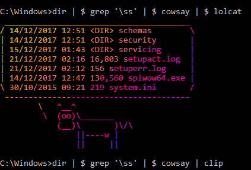
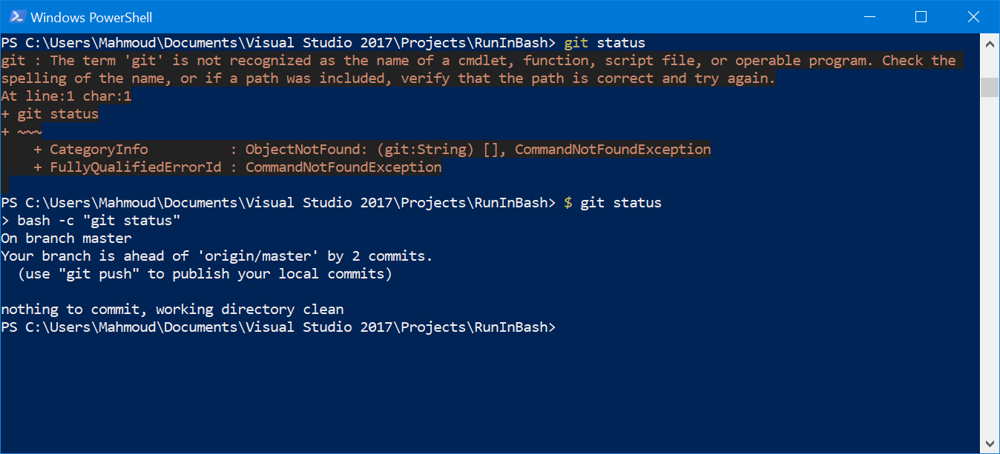

## Introduction

dir" />

`RunInBash` is a simple tool designed to make running Linux applications easier and faster under WSL. `RunInBash` simply runs whatever you type after it under a bash shell and pipes the output back to the parent command line. No need to worry about nested quotes, escaping arguments, or anything else! [Read more about `$` and `RunInBash` in the official release notes on our blog](https://neosmart.net/blog/2017/meet-your-new-best-friend-for-wsl/). Binary releases [are available for download on neosmart.net](https://neosmart.net/RunInBash/). `RunInBash` captures the exit code of the executed command and bubbles it back up to the caller, making writing complex scripts containing both Windows and Linux commands easy.

## Installation

Just copy `RunInBash.exe` to your PATH. For best results, we recommend renaming it `$.exe`, allowing you to run any Linux command by simply prefixing it with `$`, e.g. `$ ifconfig` or `$ git status`.

An automated installer will be arriving in a future update shortly.

## Screenshots & Examples



```
PS D:\git\RunInBash> git status
git : The term 'git' is not recognized as the name of a cmdlet, function, script file, or operable program. Check the
spelling of the name, or if a path was included, verify that the path is correct and try again.
At line:1 char:1
+ git status
+ ~~~
    + CategoryInfo          : ObjectNotFound: (git:String) [], CommandNotFoundException
    + FullyQualifiedErrorId : CommandNotFoundException

PS D:\git\RunInBash> $ git status
On branch master
Your branch is up-to-date with 'origin/master'.

nothing to commit, working directory clean
```

And an example of escaping magic at work:


    C:\Users\NeoSmart>$ printf "It's just like \"%s\"!" magic
    It's just like "magic"!

And here's how `RunInBash` can make advanced `(bash|power)`shell scripting pure joy:


